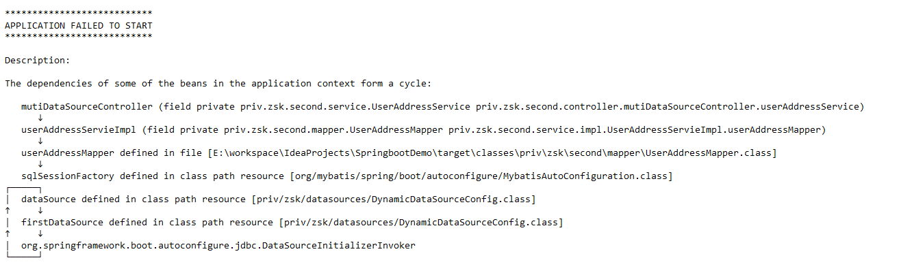
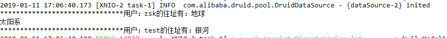

### 说明
##### 项目介绍
- 项目基于简单的springboot，主要用于演示通过注解的方式实现多数据源的切换
- 执行流程
   - 测试方法在priv.zsk.second.controller.mutiDataSourceController.java
   - 具体流程，先查询

##### 注意事项
- 有关多数据源的配置都放在priv.zsk.datasources包下
- 同时注意需要在启动类里面，加上： `@SpringBootApplication(exclude = {DataSourceAutoConfiguration.class})`
否则会出现如图1所示的错误：

##### 新增数据源时修改项：
1. 需要在.yml中添加相应的数据源地址的配置
2. 在priv.zsk.datasources.DataSourceNames.java中增加数据源的名称
3. 在priv.zsk.datasources.DynamicDataSourceConfig.java中增加相关的配置

##### 测试方法
1. 运行项目后，在浏览器中输入http://localhost:8080/SpringbootDemo/mutiDataSource/mutiDataSourceCheck
2. 查看控制台，输出结果如图2所示：
